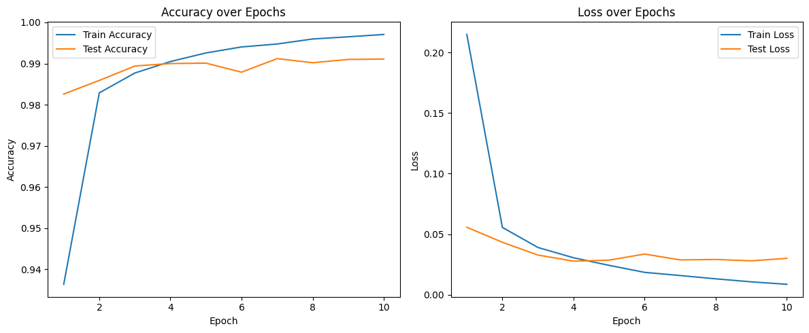
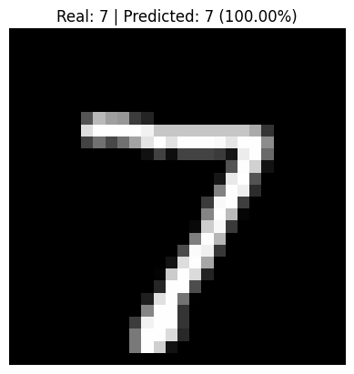

Handwritten Digit Recognition with CNN

This project demonstrates a Convolutional Neural Network (CNN) built with TensorFlow and Keras to recognize handwritten digits from the MNIST dataset.

Model Architecture:
The CNN model includes the following layers:
Conv2D (32 filters, 3x3 kernel, ReLU)
MaxPooling2D (2x2)
Conv2D (64 filters, 3x3 kernel, ReLU)
MaxPooling2D (2x2)
Flatten
Dense (128 neurons, ReLU)
Dense (10 neurons, Softmax)

The model achieves an accuracy of approximately 99% on the test set after training for 10 epochs.

Training Results:
The model was trained using the Adam optimizer and categorical cross-entropy loss.
Below is the training accuracy and loss over epochs:

Prediction Example:
Here is an example of a test image predicted by the model.
The model correctly identified the digit with a high confidence:

